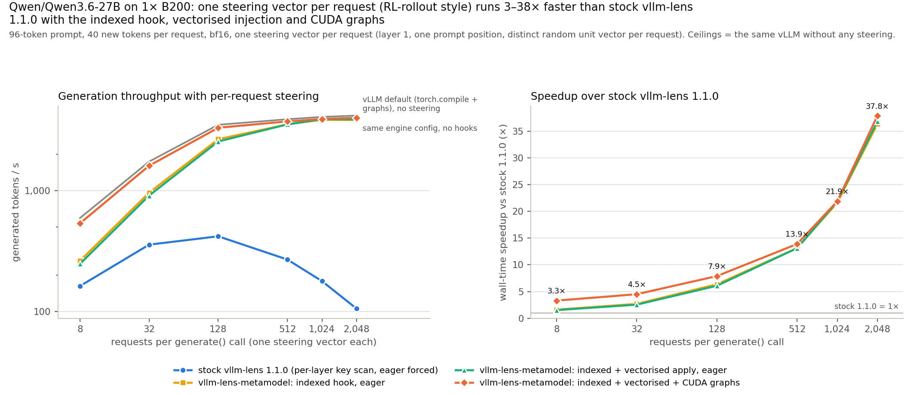
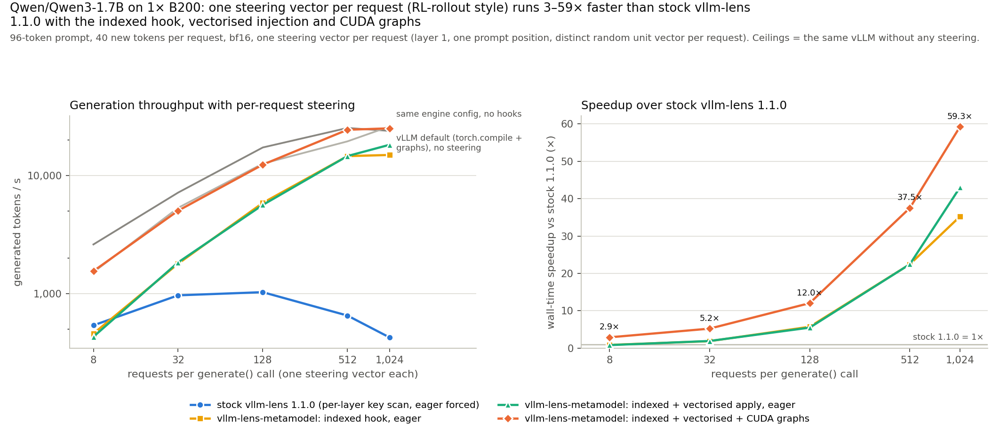

# vllm-metamodel

<p align="center">
  
  
</p>

**A drop-in replacement for [vllm-lens](https://github.com/UKGovernmentBEIS/vllm-lens) for meta-model workloads (Activation Oracles, MAEMMs, LoRAcles, NLAs) but 3-59x faster**

Meta-models need you to inject an activation (or soft token) into the model at some position. Because vllm doesn't support this, we generally use a library called [vllm-lens](https://github.com/UKGovernmentBEIS/vllm-lens), a vllm plugin that allows for steering residual stream.

However, vllm-lens does not go brr. At large batch sizes it is up to ~40x slower than standard vllm, and the reason is dumb: its forward hook runs on every single forward pass (i.e. every generated token, for every hooked layer), and on every pass it does a python for loop over every request in the batch, string-matching the request id against every registered steering key, doing two gpu syncs per request to find its rows, and cloning the layer output. It does this whether or not any vector actually applies on that step.~~I~~ Fable rewrote the hook to index the steering configs in a hashmap, build one plan per forward pass from host-side buffers (no gpu syncs), skip idle steps on a single check, and apply all vectors with one index_add_ instead of a loop. 

**Anyway, this makes generation like 40x faster and should just be merged into vllm-lens but whatever**

This change also allows you to use cuda-graphs after prefill, since meta-models generally only inject once at one token index during prefill, we can get near vllm-level performance with them applied for meta-models! yippee!

```bash
pip install git+https://github.com/ceselder/vllm-metamodel
```

# Cleaned up claudeslop information below

## Comparisons
The comparisons I did are for the exact situation for the model I'm training for my upcoming paper: MAEMMs

Measured on 1× B200, Qwen/Qwen3.6-27B bf16, 96-token prompts, generating 40 new tokens, one distinct steering vector per request (layer 1, one prompt position): at B = 2,048 the fork is **37.8× faster** than stock 1.1.0 with CUDA graphs (36.3× from the indexed hook alone, 36.8× with the vectorised apply, eager), coming within +-5% of not doing steering at all.



Wall time of one `LLM.generate()` call (Qwen/Qwen3.6-27B, speedup vs stock in bold):

| configuration | B = 8 | B = 32 | B = 128 | B = 512 | B = 1,024 | B = 2,048 |
|---|---:|---:|---:|---:|---:|---:|
| stock vllm-lens 1.1.0 (eager forced) | 2.0 s | 3.6 s | 12.3 s | 76.3 s | 230.2 s | 777.6 s |
| fork: indexed/vectorized steering hook (eager) | 1.3 s (**1.5×**) | 1.4 s (**2.5×**) | 2.0 s (**6.1×**) | 5.8 s (**13.1×**) | 10.5 s (**21.8×**) | 21.1 s (**36.8×**) |
| fork: indexed/vectorized steering hook + CUDA graphs | 0.6 s (**3.3×**) | 0.8 s (**4.5×**) | 1.6 s (**7.9×**) | 5.5 s (**13.9×**) | 10.5 s (**21.9×**) | 20.5 s (**37.8×**) |
| vLLM baseline (compile + graphs) (ceiling) | 0.5 s (**3.7×**) | 0.7 s (**4.9×**) | 1.5 s (**8.4×**) | 5.3 s (**14.5×**) | 10.1 s (**22.8×**) | 19.7 s (**39.5×**) |

Eager rows ran with `max_num_seqs=2048` (B = 2,048 in one scheduler wave); the CUDA-graph rows with `max_num_seqs=1024` and vLLM's default capture ladder (`max_cudagraph_capture_size=1024`), so B = 2,048 is two waves there -- see the vLLM caveat below (packed GDN decode kernel grid limit). Decode at these sizes is compute-bound and scales linearly (2,048 takes 2x the 1,024 time in every configuration).

The gap is even bigger on smaller models, where the hook is actually the majority of overhead in a lot of cases (Qwen/Qwen3-1.7B, same experiment)



| configuration | B = 8 | B = 32 | B = 128 | B = 512 | B = 1,024 |
|---|---:|---:|---:|---:|---:|
| stock vllm-lens 1.1.0 (eager forced) | 0.6 s | 1.3 s | 5.0 s | 31.5 s | 96.8 s |
| fork: indexed hook (eager) | 0.7 s (**0.9×**) | 0.7 s (**1.9×**) | 0.9 s (**5.7×**) | 1.4 s (**22.4×**) | 2.7 s (**35.2×**) |
| fork: indexed/vectorized steering hook apply (eager) | 0.7 s (**0.8×**) | 0.7 s (**1.9×**) | 0.9 s (**5.5×**) | 1.4 s (**22.5×**) | 2.3 s (**43.0×**) |
| fork: indexed/vectorized steering hook + CUDA graphs | 0.2 s (**2.9×**) | 0.3 s (**5.2×**) | 0.4 s (**12.0×**) | 0.8 s (**37.5×**) | 1.6 s (**59.3×**) |
| vLLM  baseline (compile + graphs) (ceiling) | 0.1 s (**4.8×**) | 0.2 s (**7.4×**) | 0.3 s (**16.8×**) | 0.8 s (**38.9×**) | 1.7 s (**56.3×**) |

Full numbers, per-condition hook counters and every correctness assertion: `bench/results/` (`python bench/compare.py bench/results/<timestamp>`).
<!-- RESULTS:END -->

## Embedding replacement (NLA / metamodels on hyper-connection architectures)

Layer-output steering is undefined on architectures whose decoder layers emit
multi-stream outputs (hyper-connections, e.g. **DeepSeek-V4**: every layer
boundary carries a 4-stream residual stack — there is no single tensor to add
a vector to). NLA-style metamodels also *specify* their injection at the
embedding: *replace the marker token's embedding with α·v/‖v‖*.

This fork supports both, via `mode="replace"` and the `EMBED_LAYER_INDEX`
sentinel:

```python
from vllm_lens import SteeringVector, EMBED_LAYER_INDEX

# NLA injection: overwrite the marker token's embedding with alpha * v/||v||
v = activation / activation.norm()
sv = SteeringVector(
    activations=v.reshape(1, 1, -1),      # (n_layers=1, n_positions=1, hidden)
    layer_indices=[EMBED_LAYER_INDEX],    # the embedding stream, not a layer output
    position_indices=[marker_pos],        # absolute prompt position of the marker
    mode="replace",                       # overwrite, don't add
    scale=alpha,                          # e.g. p75 of the layer's activation norms
)
```

Semantics:
- `mode="replace"` overwrites the hidden row with `scale * v`
  (`norm_match=True` instead writes `scale * ‖h_orig‖ · v/‖v‖`). Requires 3-D
  (position-specific) activations — broadcast replacement is rejected.
- `EMBED_LAYER_INDEX` targets the hidden states *entering* decoder layer 0
  (the embedding output). It is applied by the first layer's **pre-hook**, so
  it never touches the (possibly multi-stream) layer outputs and works on any
  architecture. `mode="replace"` also works on regular layer indices for
  standard architectures.
- Injection happens during prefill only (markers are prompt positions), so
  **decode-only CUDA graphs stay legal** — same performance story as the
  indexed steering hook. Chunked prefill is handled: the replacement lands in
  whichever chunk contains the marker's absolute position.

This is the injection mode used to RL-train the DeepSeek-V4-Flash NLA
(embedding replacement at TP8 on the native fp8 engine, measured within ~5%
of injection-free vLLM throughput with decode CUDA graphs).

## Overview of changes
| | stock 1.1.0 | vllm-metamodel |
|---|---|---|
| resolve a request's vectors | `startswith` over all keys, every layer, every step | dict lookups, once per request, cached |
| per-step bookkeeping | 2 device syncs per request per layer | one plan per forward pass from host-side buffers |
| decode steps with nothing to do | full scan + clone of every layer output | pre-hook flags the pass idle; hooks return on one check (or the decode runs inside a CUDA graph, no Python at all) |
| applying the vectors | one Python iteration + one kernel per row | one `index_add_` for all rows of a layer (norm-match batched) |
| shipping vectors to the worker | one RPC per request | one `[n, d]` block RPC per `generate()` call |
| CUDA graphs | impossible (`enforce_eager` forced) | opt-in: `VLLM_LENS_CUDA_GRAPHS=1` → decode graphs, prompt-position steering |

### What changed (small, upstreamable diff)
Only two library files change against upstream `v1.1.0`; every upstream function stays
verbatim (`_get_layers`, `_find_steering_configs`, `norm_match`, `_apply_steering`, the
capture / state methods) and only the body of `_hook_inner` is replaced. `git diff v1.1.0 --stat`:

<!-- DIFFSTAT:BEGIN -->
```
 pyproject.toml                   |   7 +-
 vllm_lens/_activations_plugin.py | 226 +++++++++++-
 vllm_lens/_worker_ext.py         | 779 ++++++++++++++++++++++++++++++++++-----
 3 files changed, 901 insertions(+), 111 deletions(-)
```
<!-- DIFFSTAT:END -->

`vllm_lens/_worker_ext.py`
- `_SteerEntry` / `_index_configs` / `_prefix_keys` / `_resolve_entries` — per-key summary built at `set_steering_data` time; a request's keys are found by dict lookups on its `_steering_id` and on the `-`-boundary prefixes of its internal id (exactly the set the old scan matched: vLLM ids are `"{external}-{8 hex}"`; multi-key matches keep insertion order).
- `_ReqPlan` (per-request, cached, invalidated on any set/clear) and `_StepPlan` (one per forward pass, built by the first layer hook from `runner.query_start_loc.np` / `input_batch.num_computed_tokens_cpu`, no device syncs). A row is scheduled for a layer only when one of its vectors can touch a position computed in this pass — chunked prefill steers the marker in exactly the chunk that computes it.
- `_make_pre_hook` / `_step_is_idle` — pre-hook on the first decoder layer; idle passes (uniform decode, no broadcast vectors, all positional vectors behind every row, no capture in flight) cost one flag check per layer.
- `_apply_layer_vectorized` — stack all (row, vector) pairs of a layer/pass, one `index_add_`; falls back to upstream's `_apply_steering` when a row would receive several vectors or a broadcast vector covers a multi-token chunk. Bit-identical for `norm_match=False`.
- New RPCs: `set_steering_block`, `set_steering_data_many`, `clear_steering_data_many`, `set_vectorized`, `steering_stats`. Existing `set_steering_data` / `clear_steering_data` also maintain the index.

`vllm_lens/_activations_plugin.py`
- `_patched_create_engine_config` forces `enforce_eager` only unless `VLLM_LENS_CUDA_GRAPHS=1` (`_configure_cuda_graphs` then sets compilation mode `NONE` + `cudagraph_mode=FULL_DECODE_ONLY` unless you passed a compatible config).
- Offline `LLM.generate`: one `set_steering_block` RPC for the call's single-position vectors (+ one `set_steering_data_many` for anything else) instead of one RPC per request; clears in a `finally`.
- `VLLM_LENS_DISABLE=1` no-op switch (as in upstream 1.2.0); `_check_graph_mode_request` fails fast on 2-D vectors under CUDA graphs.

### CUDA graphs

```python
import os
os.environ["VLLM_LENS_CUDA_GRAPHS"] = "1"          # before the engine is built
llm = LLM(model, compilation_config={"cudagraph_capture_sizes": [8, 64, 512, 1024]})  # optional
```

With `cudagraph_mode=FULL_DECODE_ONLY` (and no `torch.compile`, so the hooks still fire),
uniform-decode batches replay CUDA graphs — no Python runs, decode is exactly as fast as
without the plugin — while every batch that contains prompt tokens runs eagerly with the
hooks live. Steering and capture are therefore **prompt-position only** in this mode: the
worker never touches generated positions (even on mixed batches that happen to run
eagerly, so results do not depend on batch composition), 2-D broadcast vectors are refused
with a `ValueError`, and `output_residual_stream` returns prompt positions only (warned
once). If chunked prefill could leave a 1-token final chunk (dispatched as a decode graph)
the fork warns at hook installation — set `max_num_batched_tokens` above your longest
prompt × concurrency. Without the variable, behaviour is exactly 1.1.0's (eager forced).

**known vLLM bug for hybrid GatedDeltaNet models such as Qwen3.5/3.6, vLLM 0.19:** keep `max_num_seqs <= 1024` when CUDA graphs are on. vLLM's packed GDN decode kernel launches a `batch x value_heads` grid (48 heads on Qwen3.6-27B) and the CUDA grid-dimension limit is 65,535; with `max_num_seqs=2048` the engine died at start-up in the graph warm-up (`Triton Error [CUDA]: invalid argument`) with or without vllm-lens, while `max_num_seqs=1024` with vLLM's default capture ladder (`compilation_config={"max_cudagraph_capture_size": 1024}`) works (`bench/diag_engine.py`; LoRA on/off and the packed kernel on/off make no difference). Batches larger than `max_num_seqs` simply run as several scheduler waves.

