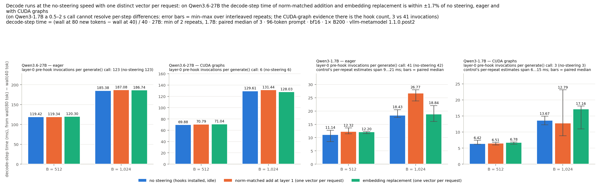
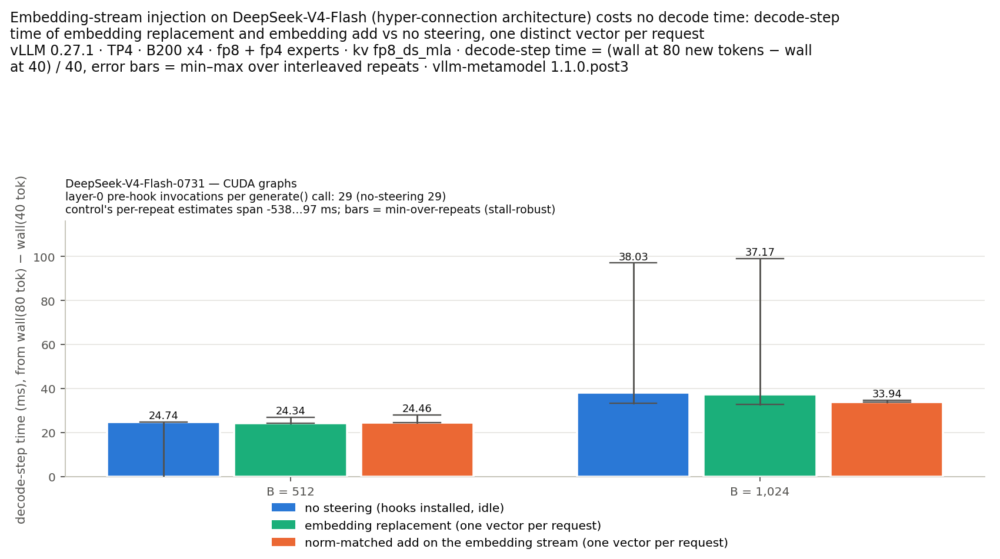

# vllm-metamodel

<p align="center">
  
  
</p>

**A drop-in replacement for [vllm-lens](https://github.com/UKGovernmentBEIS/vllm-lens) for meta-model workloads (Activation Oracles, MAEMMs, LoRAcles, NLAs) but 3-59x faster**

Meta-models need you to inject an activation (or soft token) into the model at some position. Because vllm doesn't support this, we generally use a library called [vllm-lens](https://github.com/UKGovernmentBEIS/vllm-lens), a vllm plugin that allows for steering residual stream.

However, vllm-lens does not go brr. At large batch sizes it is up to ~40x slower than standard vllm, and the reason is dumb: its forward hook runs on every single forward pass (i.e. every generated token, for every hooked layer), and on every pass it does a python for loop over every request in the batch, string-matching the request id against every registered steering key, doing two gpu syncs per request to find its rows, and cloning the layer output. It does this whether or not any vector actually applies on that step.~~I~~ Fable rewrote the hook to index the steering configs in a hashmap, build one plan per forward pass from host-side buffers (no gpu syncs), skip idle steps on a single check, and apply all vectors with one index_add_ instead of a loop. 

**Anyway, this makes generation like 40x faster and should just be merged into vllm-lens but whatever**

This change also allows you to use cuda-graphs after prefill, since meta-models generally only inject once at one token index during prefill, we can get near vllm-level performance with them applied for meta-models! yippee!

```bash
pip install git+https://github.com/ceselder/vllm-metamodel
```

# Cleaned up claudeslop information below

## Comparisons
The comparisons I did are for the exact situation for the model I'm training for my upcoming paper: MAEMMs

Measured on 1× B200, Qwen/Qwen3.6-27B bf16, 96-token prompts, generating 40 new tokens, one distinct steering vector per request (layer 1, one prompt position): at B = 2,048 the fork is **37.8× faster** than stock 1.1.0 with CUDA graphs (36.3× from the indexed hook alone, 36.8× with the vectorised apply, eager), coming within +-5% of not doing steering at all.


Wall time of one `LLM.generate()` call (Qwen/Qwen3.6-27B, speedup vs stock in bold):

| configuration | B = 8 | B = 32 | B = 128 | B = 512 | B = 1,024 | B = 2,048 |
|---|---:|---:|---:|---:|---:|---:|
| stock vllm-lens 1.1.0 (eager forced) | 2.0 s | 3.6 s | 12.3 s | 76.3 s | 230.2 s | 777.6 s |
| fork: indexed/vectorized steering hook (eager) | 1.3 s (**1.5×**) | 1.4 s (**2.5×**) | 2.0 s (**6.1×**) | 5.8 s (**13.1×**) | 10.5 s (**21.8×**) | 21.1 s (**36.8×**) |
| fork: indexed/vectorized steering hook + CUDA graphs | 0.6 s (**3.3×**) | 0.8 s (**4.5×**) | 1.6 s (**7.9×**) | 5.5 s (**13.9×**) | 10.5 s (**21.9×**) | 20.5 s (**37.8×**) |
| vLLM baseline (compile + graphs) (ceiling) | 0.5 s (**3.7×**) | 0.7 s (**4.9×**) | 1.5 s (**8.4×**) | 5.3 s (**14.5×**) | 10.1 s (**22.8×**) | 19.7 s (**39.5×**) |

Eager rows ran with `max_num_seqs=2048` (B = 2,048 in one scheduler wave); the CUDA-graph rows with `max_num_seqs=1024` and vLLM's default capture ladder (`max_cudagraph_capture_size=1024`), so B = 2,048 is two waves there -- see the vLLM caveat below (packed GDN decode kernel grid limit). Decode at these sizes is compute-bound and scales linearly (2,048 takes 2x the 1,024 time in every configuration).

The gap is even bigger on smaller models, where the hook is actually the majority of overhead in a lot of cases (Qwen/Qwen3-1.7B, same experiment)


| configuration | B = 8 | B = 32 | B = 128 | B = 512 | B = 1,024 |
|---|---:|---:|---:|---:|---:|
| stock vllm-lens 1.1.0 (eager forced) | 0.6 s | 1.3 s | 5.0 s | 31.5 s | 96.8 s |
| fork: indexed hook (eager) | 0.7 s (**0.9×**) | 0.7 s (**1.9×**) | 0.9 s (**5.7×**) | 1.4 s (**22.4×**) | 2.7 s (**35.2×**) |
| fork: indexed/vectorized steering hook apply (eager) | 0.7 s (**0.8×**) | 0.7 s (**1.9×**) | 0.9 s (**5.5×**) | 1.4 s (**22.5×**) | 2.3 s (**43.0×**) |
| fork: indexed/vectorized steering hook + CUDA graphs | 0.2 s (**2.9×**) | 0.3 s (**5.2×**) | 0.4 s (**12.0×**) | 0.8 s (**37.5×**) | 1.6 s (**59.3×**) |
| vLLM  baseline (compile + graphs) (ceiling) | 0.1 s (**4.8×**) | 0.2 s (**7.4×**) | 0.3 s (**16.8×**) | 0.8 s (**38.9×**) | 1.7 s (**56.3×**) |

Full numbers, per-condition hook counters and every correctness assertion: `bench/results/` (`python bench/compare.py bench/results/<timestamp>`).
<!-- RESULTS:END -->

Changelog: [CHANGELOG.md](CHANGELOG.md) (current: **1.1.0.post2** — embedding replacement + `norm_match` on the full residual stream).

## Embedding replacement (NLA / metamodels on hyper-connection architectures)

Layer-output steering is undefined on architectures whose decoder layers emit
multi-stream outputs (hyper-connections, e.g. **DeepSeek-V4**: every layer
boundary carries a 4-stream residual stack — there is no single tensor to add
a vector to). NLA-style metamodels also *specify* their injection at the
embedding: *replace the marker token's embedding with α·v/‖v‖*.

This fork supports both, via `mode="replace"` and the `EMBED_LAYER_INDEX`
sentinel:

```python
from vllm_lens import SteeringVector, EMBED_LAYER_INDEX

# NLA injection: overwrite the marker token's embedding with alpha * v/||v||
v = activation / activation.norm()
sv = SteeringVector(
    activations=v.reshape(1, 1, -1),      # (n_layers=1, n_positions=1, hidden)
    layer_indices=[EMBED_LAYER_INDEX],    # the embedding stream, not a layer output
    position_indices=[marker_pos],        # absolute prompt position of the marker
    mode="replace",                       # overwrite, don't add
    scale=alpha,                          # e.g. p75 of the layer's activation norms
)
```

Semantics:
- `mode="replace"` overwrites the hidden row with `scale * v`
  (`norm_match=True` instead writes `scale * ‖h_orig‖ · v/‖v‖`). Requires 3-D
  (position-specific) activations — broadcast replacement is rejected.
- `EMBED_LAYER_INDEX` targets the hidden states *entering* decoder layer 0
  (the embedding output). It is applied by the first layer's **pre-hook**, so
  it never touches the (possibly multi-stream) layer outputs and works on any
  architecture. The pre-hook is registered with `with_kwargs=True` and finds
  the hidden states among positional *and* keyword inputs (Qwen3.5/3.6's
  `Qwen3NextModel` calls `layer(positions=…, hidden_states=…, residual=…)` by
  keyword, Qwen2/Llama positionally); it requires exactly one
  `[≥ total_tokens, hidden]` floating candidate and otherwise raises
  `EmbedInjectionError` out of the forward pass (counted in `embed_errors`) —
  never a silent skip.
- `mode="replace"` on a regular layer index of a fused-residual model (Qwen,
  Llama, Gemma, …: layers return `(hidden_states, residual)`) rewrites **both
  halves** (`hidden_states[row] = scale·v`, `residual[row] = 0`) so the full
  residual stream equals `scale·v` exactly; vectorised (`index_copy_`).
- `output_residual_stream=[EMBED_LAYER_INDEX, …]` captures the (post-injection)
  embedding stream as layer -1; `output_residual_stream=True` is unchanged.
- Injection happens during prefill only (markers are prompt positions), so
  **decode-only CUDA graphs stay legal** — same performance story as the
  indexed steering hook (measured: hooks run on 2 of 41 forward passes at
  B=1,024, wall time equal to no steering). Chunked prefill is handled: the
  replacement lands in whichever chunk contains the marker's absolute position
  (tested with the marker in a first and in a non-first 64-token chunk).

This is the injection mode used to RL-train the DeepSeek-V4-Flash NLA
(embedding replacement at TP8 on the native fp8 engine, measured within ~5%
of injection-free vLLM throughput with decode CUDA graphs).

## Karvonen-style (norm-matched) injection: `norm_match=True, scale=coeff`

Activation-oracle / MAEMM trainers inject `h' = h + coeff · ‖h‖ · v/‖v‖` at a
decoder layer's output, with an HF forward hook on the decoder layer
(reference: `mxf/inject.py::make_inject_hook`). In this fork that is exactly

```python
sv = SteeringVector(
    activations=v.reshape(1, 1, -1),   # any magnitude: only the direction is used
    layer_indices=[layer],
    position_indices=[marker_pos],
    norm_match=True,                   # scale to ‖h‖ of the FULL residual stream at that position
    scale=coeff,                       # h' = h + coeff · ‖h‖ · v/‖v‖
)
```

**Behaviour change vs vllm-lens 1.1.0 / fork post1.** vLLM's decoder layers on
Qwen / Llama / Gemma / Mistral return `(hidden_states, residual)` and the
residual stream is their *sum*. 1.1.0 measured `‖·‖` on `hidden_states` alone
(the MLP-delta half), so `norm_match=True` injected `coeff · ‖hidden_states‖ ·
v/‖v‖` — on Qwen3.6-27B layer 1 a magnitude ratio of **0.123** (≈ 8× too weak,
and a different factor per model and layer). Upstream fixed this in 1.2.0
(#7); 1.1.0.post2 ports the fix into the sequential, vectorised and
CUDA-graph paths, so `norm_match=True, scale=coeff` now matches the HF hook
to cos ≥ 0.99998 and magnitude ratio within 5e-4 of `coeff` (test matrix
below, both models, eager and graphs, one distinct vector per request). If you relied on the old behaviour, your
effective coefficient changes; trainers that worked around it by passing an
absolute vector with `norm_match=False` are unaffected.

## Injection modes: GPU test matrix

<!-- INJECTION:BEGIN -->
`bench/test_injection_modes.py` on 1× B200 (vLLM 0.19.0, torch 2.10.0+cu128, vllm-lens 1.1.0.post2),
models Qwen/Qwen3.6-27B, Qwen/Qwen3-1.7B; engines eager, eager +chunked, graphs, graphs +chunked; **278/278 gated checks pass**
(all; 10 throughput gates on the 1.7B — decode-step time and the eager wall ratio — are below the measurement resolution of a 0.5–2 s call (control repeat spread 13–28%) and are reported as informational, not as passes). Every request in a batch carries its own unit vector; B is the number of requests
per `generate()` call; the marker is prompt position 10 (chunked engines also test position 70, i.e. a non-first 64-token
chunk). "cos(Δ, v)" / "‖Δ‖/(c·‖h‖) − 1" are the worst request of the batch; "other rows" is the max absolute change of any
non-marker row of the captured layer (0 = bit-identical). The HF reference is the same model in transformers with the
trainer's exact hook (`mxf/inject.py`, `h + coeff·‖h‖·v/‖v‖` on the decoder-layer output); the log-prob noise floor is
the vLLM-vs-HF difference on the clean prompt.

| model | engine | case | B | coeff / scale | cos(Δ, v) | ‖Δ‖/(c·‖h‖) − 1 or bf16 rel err | other rows max\|Δ\| | vs HF reference | checks |
|---|---|---|---:|---|---:|---:|---:|---|---|
| Qwen3-1.7B | eager | karvonen_add | 64 | coeff 1.0 | 0.99999 | 3.7e-04 | 0.0e+00 | cos 1.0000, norm ratio 1.0020 | 4/4 |
| Qwen3-1.7B | eager | karvonen_add | 512 | coeff 1.0 | 0.99999 | 2.8e-04 | 0.0e+00 | — | 3/3 |
| Qwen3-1.7B | eager | karvonen_add | 64 | coeff 4.0 | 0.99999 | 3.1e-04 | 0.0e+00 | cos 1.0000, norm ratio 1.0018 | 4/4 |
| Qwen3-1.7B | eager | karvonen_add | 512 | coeff 4.0 | 0.99999 | 1.5e-04 | 0.0e+00 | — | 3/3 |
| Qwen3-1.7B | eager | karvonen_add_generation | — | coeff 1.0 | — | — | — | next-token logprob max diff 0.135 (clean-prompt noise 0.239); greedy-8 equal 4/4 | 2/2 |
| Qwen3-1.7B | eager | karvonen_add_generation | — | coeff 4.0 | — | — | — | next-token logprob max diff 0.237 (clean-prompt noise 0.239); greedy-8 equal 4/4 | 2/2 |
| Qwen3-1.7B | eager | layer_replace | 64 | scale 23.16 | 1.00000 | 7.8e-03 | 0.0e+00 | — | 3/3 |
| Qwen3-1.7B | eager | embed_replace | 64 | scale 1.38 | 1.00000 | 7.6e-03 | 0.0e+00 | — | 4/4 |
| Qwen3-1.7B | eager | embed_replace | 512 | scale 1.38 | 1.00000 | 7.8e-03 | 0.0e+00 | — | 4/4 |
| Qwen3-1.7B | eager | embed_replace | 64 | scale 1.00 (norm_match) | 1.00000 | 7.6e-03 | 0.0e+00 | — | 4/4 |
| Qwen3-1.7B | eager | embed_replace | 512 | scale 1.00 (norm_match) | 1.00000 | 7.8e-03 | 0.0e+00 | — | 4/4 |
| Qwen3-1.7B | eager | mixed | 64 | coeff 1.0 | 0.99999 | 3.7e-04 | 0.0e+00 | — | 5/5 |
| Qwen3-1.7B | eager +chunked | chunked_m10_karvonen_add | 16 | coeff 1.0 | 0.99999 | 3.1e-04 | 0.0e+00 | — | 3/3 |
| Qwen3-1.7B | eager +chunked | chunked_m10_embed_replace | 16 | scale 1.38 | 1.00000 | 5.1e-03 | 0.0e+00 | — | 4/4 |
| Qwen3-1.7B | eager +chunked | chunked_m70_karvonen_add | 16 | coeff 1.0 | 0.99999 | 4.3e-04 | 0.0e+00 | — | 3/3 |
| Qwen3-1.7B | eager +chunked | chunked_m70_embed_replace | 16 | scale 1.38 | 1.00000 | 5.1e-03 | 0.0e+00 | — | 4/4 |
| Qwen3-1.7B | graphs | karvonen_add | 64 | coeff 1.0 | 0.99999 | 3.7e-04 | 0.0e+00 | cos 1.0000, norm ratio 1.0020 | 4/4 |
| Qwen3-1.7B | graphs | karvonen_add | 512 | coeff 1.0 | 0.99999 | 2.8e-04 | 0.0e+00 | — | 3/3 |
| Qwen3-1.7B | graphs | karvonen_add | 64 | coeff 4.0 | 0.99999 | 3.1e-04 | 0.0e+00 | cos 1.0000, norm ratio 1.0018 | 4/4 |
| Qwen3-1.7B | graphs | karvonen_add | 512 | coeff 4.0 | 0.99999 | 1.5e-04 | 0.0e+00 | — | 3/3 |
| Qwen3-1.7B | graphs | karvonen_add_generation | — | coeff 1.0 | — | — | — | next-token logprob max diff 0.135 (clean-prompt noise 0.239); greedy-8 equal 4/4 | 2/2 |
| Qwen3-1.7B | graphs | karvonen_add_generation | — | coeff 4.0 | — | — | — | next-token logprob max diff 0.237 (clean-prompt noise 0.239); greedy-8 equal 4/4 | 2/2 |
| Qwen3-1.7B | graphs | layer_replace | 64 | scale 23.16 | 1.00000 | 7.8e-03 | 0.0e+00 | — | 3/3 |
| Qwen3-1.7B | graphs | embed_replace | 64 | scale 1.38 | 1.00000 | 7.6e-03 | 0.0e+00 | — | 4/4 |
| Qwen3-1.7B | graphs | embed_replace | 512 | scale 1.38 | 1.00000 | 7.8e-03 | 0.0e+00 | — | 4/4 |
| Qwen3-1.7B | graphs | embed_replace | 64 | scale 1.00 (norm_match) | 1.00000 | 7.6e-03 | 0.0e+00 | — | 4/4 |
| Qwen3-1.7B | graphs | embed_replace | 512 | scale 1.00 (norm_match) | 1.00000 | 7.8e-03 | 0.0e+00 | — | 4/4 |
| Qwen3-1.7B | graphs | mixed | 64 | coeff 1.0 | 0.99999 | 3.7e-04 | 0.0e+00 | — | 5/5 |
| Qwen3-1.7B | graphs +chunked | chunked_m10_karvonen_add | 16 | coeff 1.0 | 0.99999 | 3.1e-04 | 0.0e+00 | — | 3/3 |
| Qwen3-1.7B | graphs +chunked | chunked_m10_embed_replace | 16 | scale 1.38 | 1.00000 | 5.1e-03 | 0.0e+00 | — | 4/4 |
| Qwen3-1.7B | graphs +chunked | chunked_m70_karvonen_add | 16 | coeff 1.0 | 0.99999 | 4.3e-04 | 0.0e+00 | — | 3/3 |
| Qwen3-1.7B | graphs +chunked | chunked_m70_embed_replace | 16 | scale 1.38 | 1.00000 | 5.1e-03 | 0.0e+00 | — | 4/4 |
| Qwen3.6-27B | eager | karvonen_add | 64 | coeff 1.0 | 0.99999 | 1.9e-04 | 0.0e+00 | cos 1.0000, norm ratio 1.0001 | 4/4 |
| Qwen3.6-27B | eager | karvonen_add | 512 | coeff 1.0 | 0.99999 | 1.7e-04 | 0.0e+00 | — | 3/3 |
| Qwen3.6-27B | eager | karvonen_add | 64 | coeff 4.0 | 0.99999 | 2.4e-04 | 0.0e+00 | cos 1.0000, norm ratio 1.0002 | 4/4 |
| Qwen3.6-27B | eager | karvonen_add | 512 | coeff 4.0 | 0.99999 | 1.7e-04 | 0.0e+00 | — | 3/3 |
| Qwen3.6-27B | eager | karvonen_add_generation | — | coeff 1.0 | — | — | — | next-token logprob max diff 0.103 (clean-prompt noise 0.253); greedy-8 equal 3/4 | 2/2 |
| Qwen3.6-27B | eager | karvonen_add_generation | — | coeff 4.0 | — | — | — | next-token logprob max diff 0.121 (clean-prompt noise 0.253); greedy-8 equal 3/4 | 2/2 |
| Qwen3.6-27B | eager | layer_replace | 64 | scale 13.19 | 1.00000 | 6.3e-03 | 0.0e+00 | — | 3/3 |
| Qwen3.6-27B | eager | embed_replace | 64 | scale 0.97 | 1.00000 | 7.1e-03 | 0.0e+00 | — | 4/4 |
| Qwen3.6-27B | eager | embed_replace | 512 | scale 0.97 | 1.00000 | 5.3e-03 | 0.0e+00 | — | 4/4 |
| Qwen3.6-27B | eager | embed_replace | 64 | scale 1.00 (norm_match) | 1.00000 | 5.3e-03 | 0.0e+00 | — | 4/4 |
| Qwen3.6-27B | eager | embed_replace | 512 | scale 1.00 (norm_match) | 1.00000 | 5.3e-03 | 0.0e+00 | — | 4/4 |
| Qwen3.6-27B | eager | mixed | 64 | coeff 1.0 | 0.99999 | 1.9e-04 | 0.0e+00 | — | 5/5 |
| Qwen3.6-27B | eager +chunked | chunked_m10_karvonen_add | 16 | coeff 1.0 | 0.99999 | 1.4e-04 | 0.0e+00 | — | 3/3 |
| Qwen3.6-27B | eager +chunked | chunked_m10_embed_replace | 16 | scale 0.97 | 1.00000 | 5.3e-03 | 0.0e+00 | — | 4/4 |
| Qwen3.6-27B | eager +chunked | chunked_m70_karvonen_add | 16 | coeff 1.0 | 0.99999 | 2.3e-04 | 0.0e+00 | — | 3/3 |
| Qwen3.6-27B | eager +chunked | chunked_m70_embed_replace | 16 | scale 0.97 | 1.00000 | 5.3e-03 | 0.0e+00 | — | 4/4 |
| Qwen3.6-27B | graphs | karvonen_add | 64 | coeff 1.0 | 0.99999 | 1.9e-04 | 0.0e+00 | cos 1.0000, norm ratio 1.0001 | 4/4 |
| Qwen3.6-27B | graphs | karvonen_add | 512 | coeff 1.0 | 0.99999 | 1.7e-04 | 0.0e+00 | — | 3/3 |
| Qwen3.6-27B | graphs | karvonen_add | 64 | coeff 4.0 | 0.99999 | 2.4e-04 | 0.0e+00 | cos 1.0000, norm ratio 1.0002 | 4/4 |
| Qwen3.6-27B | graphs | karvonen_add | 512 | coeff 4.0 | 0.99999 | 1.7e-04 | 0.0e+00 | — | 3/3 |
| Qwen3.6-27B | graphs | karvonen_add_generation | — | coeff 1.0 | — | — | — | next-token logprob max diff 0.103 (clean-prompt noise 0.253); greedy-8 equal 3/4 | 2/2 |
| Qwen3.6-27B | graphs | karvonen_add_generation | — | coeff 4.0 | — | — | — | next-token logprob max diff 0.121 (clean-prompt noise 0.253); greedy-8 equal 3/4 | 2/2 |
| Qwen3.6-27B | graphs | layer_replace | 64 | scale 13.19 | 1.00000 | 6.3e-03 | 0.0e+00 | — | 3/3 |
| Qwen3.6-27B | graphs | embed_replace | 64 | scale 0.97 | 1.00000 | 7.1e-03 | 0.0e+00 | — | 4/4 |
| Qwen3.6-27B | graphs | embed_replace | 512 | scale 0.97 | 1.00000 | 5.3e-03 | 0.0e+00 | — | 4/4 |
| Qwen3.6-27B | graphs | embed_replace | 64 | scale 1.00 (norm_match) | 1.00000 | 5.3e-03 | 0.0e+00 | — | 4/4 |
| Qwen3.6-27B | graphs | embed_replace | 512 | scale 1.00 (norm_match) | 1.00000 | 5.3e-03 | 0.0e+00 | — | 4/4 |
| Qwen3.6-27B | graphs | mixed | 64 | coeff 1.0 | 0.99999 | 1.9e-04 | 0.0e+00 | — | 5/5 |
| Qwen3.6-27B | graphs +chunked | chunked_m10_karvonen_add | 16 | coeff 1.0 | 0.99999 | 1.4e-04 | 0.0e+00 | — | 3/3 |
| Qwen3.6-27B | graphs +chunked | chunked_m10_embed_replace | 16 | scale 0.97 | 1.00000 | 5.3e-03 | 0.0e+00 | — | 4/4 |
| Qwen3.6-27B | graphs +chunked | chunked_m70_karvonen_add | 16 | coeff 1.0 | 0.99999 | 2.3e-04 | 0.0e+00 | — | 3/3 |
| Qwen3.6-27B | graphs +chunked | chunked_m70_embed_replace | 16 | scale 0.97 | 1.00000 | 5.3e-03 | 0.0e+00 | — | 4/4 |

| model | engine | condition | B | wall, 40 new tok (s) | wall, 80 new tok (s) | decode step (ms) | prefill + per-call overhead (s) | tok/s | hook passes | checks |
|---|---|---|---:|---:|---:|---:|---:|---:|---:|---|
| Qwen3-1.7B | eager | nosteer | 512 | 0.65 | 1.13 | 11.14 | 0.17 | 31,354 | 41 | — |
| Qwen3-1.7B | eager | nosteer | 1024 | 1.08 | 1.82 | 18.43 | 0.35 | 37,810 | 42 | — |
| Qwen3-1.7B | eager | karvonen_add | 512 | 0.66 | 1.14 | 12.32 | 0.18 | 31,044 | 41 | 0/0 (+2 n/a) |
| Qwen3-1.7B | eager | karvonen_add | 1024 | 1.15 | 2.16 | 26.77 | 0.13 | 35,676 | 41 | 0/0 (+2 n/a) |
| Qwen3-1.7B | eager | embed_replace | 512 | 0.67 | 1.16 | 12.20 | 0.19 | 30,377 | 41 | 0/0 (+1 n/a) |
| Qwen3-1.7B | eager | embed_replace | 1024 | 1.12 | 1.87 | 18.84 | 0.36 | 36,621 | 41 | 0/0 (+1 n/a) |
| Qwen3-1.7B | graphs | nosteer | 512 | 0.47 | 0.73 | 6.42 | 0.21 | 43,702 | 2 | — |
| Qwen3-1.7B | graphs | nosteer | 1024 | 0.90 | 1.48 | 13.67 | 0.32 | 45,548 | 3 | — |
| Qwen3-1.7B | graphs | karvonen_add | 512 | 0.50 | 0.75 | 6.51 | 0.24 | 41,224 | 2 | 1/1 (+1 n/a) |
| Qwen3-1.7B | graphs | karvonen_add | 1024 | 0.96 | 1.39 | 12.79 | 0.52 | 42,882 | 4 | 1/1 (+1 n/a) |
| Qwen3-1.7B | graphs | embed_replace | 512 | 0.49 | 0.74 | 6.78 | 0.24 | 41,641 | 2 | 1/1 (+1 n/a) |
| Qwen3-1.7B | graphs | embed_replace | 1024 | 0.92 | 1.40 | 17.16 | 0.44 | 44,518 | 3 | 1/1 (+1 n/a) |
| Qwen3.6-27B | eager | nosteer | 512 | 7.70 | 12.48 | 119.42 | 2.92 | 2,660 | 82 | — |
| Qwen3.6-27B | eager | nosteer | 1024 | 13.27 | 20.69 | 185.38 | 5.86 | 3,086 | 123 | — |
| Qwen3.6-27B | eager | karvonen_add | 512 | 7.74 | 12.52 | 119.34 | 2.97 | 2,645 | 82 | 2/2 |
| Qwen3.6-27B | eager | karvonen_add | 1024 | 13.31 | 20.79 | 187.08 | 5.82 | 3,078 | 123 | 2/2 |
| Qwen3.6-27B | eager | embed_replace | 512 | 7.75 | 12.56 | 120.30 | 2.93 | 2,644 | 82 | 1/1 |
| Qwen3.6-27B | eager | embed_replace | 1024 | 13.31 | 20.78 | 186.74 | 5.84 | 3,078 | 123 | 1/1 |
| Qwen3.6-27B | graphs | nosteer | 512 | 5.66 | 8.46 | 69.88 | 2.87 | 3,617 | 4 | — |
| Qwen3.6-27B | graphs | nosteer | 1024 | 10.81 | 16.00 | 129.61 | 5.63 | 3,789 | 6 | — |
| Qwen3.6-27B | graphs | karvonen_add | 512 | 5.72 | 8.55 | 70.79 | 2.89 | 3,582 | 4 | 2/2 |
| Qwen3.6-27B | graphs | karvonen_add | 1024 | 10.84 | 16.10 | 131.44 | 5.58 | 3,779 | 6 | 2/2 |
| Qwen3.6-27B | graphs | embed_replace | 512 | 5.72 | 8.56 | 71.04 | 2.88 | 3,580 | 4 | 2/2 |
| Qwen3.6-27B | graphs | embed_replace | 1024 | 10.95 | 16.07 | 128.03 | 5.82 | 3,742 | 6 | 2/2 |



Re-run: `MODAL_PROFILE=safety-sahan modal run bench/modal_bench.py::test_injection` (both models, eager + graphs, chunked
engines, HF reference; ~25 min of B200), then `python bench/test_injection_modes.py bench/results/injection_<ts>` for the
summary and `python bench/render_injection_readme.py bench/results/injection_<ts>` for this block. Single engine by hand:
`python bench/test_injection_modes.py --model Qwen/Qwen3-1.7B --stage hf-ref --out ref.pt` then
`VLLM_LENS_CUDA_GRAPHS=1 python bench/test_injection_modes.py --model Qwen/Qwen3-1.7B --stage vllm --engine graphs --ref ref.pt --out graphs.json`.
<!-- INJECTION:END -->

## Hyper-connection architectures (DeepSeek-V4-Flash, vLLM 0.27.1, TP4)

DeepSeek-V4 (mHC, `hc_mult=4`) keeps four residual streams between layers; in vLLM each
decoder layer returns `(x, residual[T, 4, D], post_mix, res_mix)` and the true stream is a
deferred fold computed by the *next* layer. There is no single `[tokens, hidden]` tensor at
a layer boundary, so **layer-output steering and capture are undefined there** — 1.1.0.post3
detects this (`hc_mult > 1`, override `VLLM_LENS_MULTI_STREAM=0/1`) and refuses
`layer_indices=[k]` / `output_residual_stream=[k]` with a `ValueError` before the request
reaches the engine (engine stays alive); a runtime `UnsupportedLayerOutputError` backstop
is raised — never swallowed — if a multi-stream tuple ever reaches the layer hook. The
embedding entering layer 0 is a plain `[T, D]` tensor, so `EMBED_LAYER_INDEX` injection
(replace or add, ± `norm_match`) and `output_residual_stream=[EMBED_LAYER_INDEX]` work
unchanged. post3 also stops depending on `query_start_loc` being present on the attention
metadata (vLLM ≥ 0.27 moved it; the runner's host buffers are used), which is what made
vllm-lens 1.2.1's hooks silently no-op on vLLM 0.27, and sets
`VLLM_ALLOW_INSECURE_SERIALIZATION=1` for its own pickled RPC payloads.

<!-- INJECTION-DSV4:BEGIN -->
`bench/test_injection_dsv4.py` on B200 x4 (TP4, vLLM 0.27.1, torch 2.13.0+cu130, vllm-lens 1.1.0.post3;
`kv_cache_dtype=fp8_ds_mla`, `kernel_config.moe_backend=deep_gemm`, `max_num_batched_tokens=4096` so prefill is chunked;
`hc_mult=4`, `expert_dtype=fp4`): **125/126 gated checks pass**
(NOT all; 8 informational). Layer outputs on this architecture are a
deferred 4-stream fold, so the fork refuses layer-output steering / capture with a `ValueError` (engine alive) and everything
goes through the embedding stream (`EMBED_LAYER_INDEX`). The reference is the NLA session's own arithmetic
(`nla.utils.dsv4.scale_vector_to_alpha`, `alpha·v/‖v‖`) and its worker-side pre-hook (`nla.utils.dsv4_fast_hooks`),
run on the same engine; "bf16 rel err" in the table is the max relative error of the written marker row against the target.

| model | engine | case | B | coeff / scale | cos(Δ, v) | ‖Δ‖/(c·‖h‖) − 1 or bf16 rel err | other rows max\|Δ\| | vs HF reference | checks |
|---|---|---|---:|---|---:|---:|---:|---|---|
| DeepSeek-V4-Flash-0731 | eager | embed_replace | 64 | scale 1.53 | 1.00000 | 6.3e-03 | 0.0e+00 | — | 8/8 |
| DeepSeek-V4-Flash-0731 | eager | embed_replace | 64 | scale 95.50 | 1.00000 | 6.5e-03 | 0.0e+00 | — | 8/8 |
| DeepSeek-V4-Flash-0731 | eager | embed_replace | 64 | scale 1.00 (norm_match) | 1.00000 | 2.9e-03 | 0.0e+00 | — | 4/4 |
| DeepSeek-V4-Flash-0731 | eager | embed_replace | 512 | scale 1.53 | 1.00000 | 5.9e-03 | 0.0e+00 | — | 8/8 |
| DeepSeek-V4-Flash-0731 | eager | embed_replace | 512 | scale 95.50 | 1.00000 | 6.1e-03 | 0.0e+00 | — | 8/8 |
| DeepSeek-V4-Flash-0731 | eager | embed_replace | 512 | scale 1.00 (norm_match) | 1.00000 | 3.0e-03 | 0.0e+00 | — | 4/4 |
| DeepSeek-V4-Flash-0731 | eager | embed_replace_prescaled | 64 | scale 95.50 | — | — | 0.0e+00 | — | 2/2 |
| DeepSeek-V4-Flash-0731 | eager | embed_replace_prescaled | 512 | scale 95.50 | — | — | 0.0e+00 | — | 2/2 |
| DeepSeek-V4-Flash-0731 | eager | reference_impl | 64 | scale 95.50 | — | — | 0.0e+00 | — | 4/4 |
| DeepSeek-V4-Flash-0731 | eager | chunked_m70_embed_replace | 64 | scale 95.50 | 1.00000 | 6.5e-03 | 0.0e+00 | — | 4/4 |
| DeepSeek-V4-Flash-0731 | eager | chunked_m70_embed_replace | 512 | scale 95.50 | 1.00000 | 6.1e-03 | 0.0e+00 | — | 4/4 |
| DeepSeek-V4-Flash-0731 | eager | multi_stream_guard | — | — | — | — | — | — | 8/8 |
| DeepSeek-V4-Flash-0731 | eager | multi_stream_guard | — | — | — | — | — | — | 8/8 |
| DeepSeek-V4-Flash-0731 | eager | multi_stream_guard | — | — | — | — | — | — | 8/8 |
| DeepSeek-V4-Flash-0731 | eager | multi_stream_guard | — | — | — | — | — | — | 8/8 |
| DeepSeek-V4-Flash-0731 | eager | mixed | 64 | scale 95.50 | 1.00000 | 6.5e-03 | 0.0e+00 | — | 5/5 |
| DeepSeek-V4-Flash-0731 | eager | effect_check | 64 | scale 95.50 | 1.00000 | 6.5e-03 | 0.0e+00 | — | 4/4 |
| DeepSeek-V4-Flash-0731 | graphs | embed_replace | 64 | scale 1.53 | 1.00000 | 6.3e-03 | 0.0e+00 | — | 6/6 |
| DeepSeek-V4-Flash-0731 | graphs | embed_replace | 64 | scale 95.50 | 1.00000 | 6.5e-03 | 0.0e+00 | — | 6/6 |
| DeepSeek-V4-Flash-0731 | graphs | embed_replace | 64 | scale 1.00 (norm_match) | 1.00000 | 2.9e-03 | 0.0e+00 | — | 3/3 |
| DeepSeek-V4-Flash-0731 | graphs | embed_replace | 512 | scale 1.53 | 1.00000 | 5.9e-03 | 0.0e+00 | — | 6/6 |
| DeepSeek-V4-Flash-0731 | graphs | embed_replace | 512 | scale 95.50 | 1.00000 | 6.1e-03 | 0.0e+00 | — | 6/6 |
| DeepSeek-V4-Flash-0731 | graphs | embed_replace | 512 | scale 1.00 (norm_match) | 1.00000 | 3.0e-03 | 0.0e+00 | — | 3/3 |
| DeepSeek-V4-Flash-0731 | graphs | embed_replace_prescaled | 64 | scale 95.50 | — | — | 0.0e+00 | — | 2/2 |
| DeepSeek-V4-Flash-0731 | graphs | embed_replace_prescaled | 512 | scale 95.50 | — | — | 0.0e+00 | — | 2/2 |
| DeepSeek-V4-Flash-0731 | graphs | reference_impl | 64 | scale 95.50 | — | — | 0.0e+00 | — | 4/4 |
| DeepSeek-V4-Flash-0731 | graphs | chunked_m70_embed_replace | 64 | scale 95.50 | 1.00000 | 6.5e-03 | 0.0e+00 | — | 3/3 |
| DeepSeek-V4-Flash-0731 | graphs | chunked_m70_embed_replace | 512 | scale 95.50 | 1.00000 | 6.1e-03 | 0.0e+00 | — | 3/3 |
| DeepSeek-V4-Flash-0731 | graphs | multi_stream_guard | — | — | — | — | — | — | 8/8 |
| DeepSeek-V4-Flash-0731 | graphs | multi_stream_guard | — | — | — | — | — | — | 8/8 |
| DeepSeek-V4-Flash-0731 | graphs | multi_stream_guard | — | — | — | — | — | — | 8/8 |
| DeepSeek-V4-Flash-0731 | graphs | multi_stream_guard | — | — | — | — | — | — | 8/8 |
| DeepSeek-V4-Flash-0731 | graphs | mixed | 64 | scale 95.50 | 1.00000 | 6.5e-03 | 0.0e+00 | — | 6/7 FAIL |
| DeepSeek-V4-Flash-0731 | graphs | effect_check | 64 | scale 95.50 | 1.00000 | 6.5e-03 | 0.0e+00 | — | 4/4 |

| model | engine | condition | B | wall, 40 new tok (s) | wall, 80 new tok (s) | decode step (ms) | prefill + per-call overhead (s) | tok/s | hook passes | checks |
|---|---|---|---:|---:|---:|---:|---:|---:|---:|---|
| DeepSeek-V4-Flash-0731 | graphs | nosteer | 512 | 2.85 | 3.84 | -39.18 | 1.86 | 7,197 | 15 | — |
| DeepSeek-V4-Flash-0731 | graphs | nosteer | 1024 | 5.23 | 6.75 | 40.12 | 3.71 | 7,834 | 29 | — |
| DeepSeek-V4-Flash-0731 | graphs | embed_replace | 512 | 2.92 | 3.89 | 24.34 | 1.94 | 7,019 | 14 | 2/2 |
| DeepSeek-V4-Flash-0731 | graphs | embed_replace | 1024 | 5.39 | 6.88 | 37.17 | 3.90 | 7,601 | 29 | 2/2 |
| DeepSeek-V4-Flash-0731 | graphs | embed_add | 512 | 2.92 | 3.89 | 26.55 | 1.94 | 7,025 | 14 | 1/1 |
| DeepSeek-V4-Flash-0731 | graphs | embed_add | 1024 | 5.45 | 6.80 | 34.57 | 4.09 | 7,522 | 29 | 1/1 |



Re-run: `MODAL_PROFILE=safety-sahan modal run bench/modal_bench_dsv4.py::run1` (eager correctness), `::run2` (CUDA graphs:
correctness + throughput), `::run3` (throughput repeat, interleaved, 3 repeats); then
`python bench/render_dsv4_readme.py bench/results/dsv4_run1_eager_<ts> bench/results/dsv4_run2_graphs_<ts> bench/results/dsv4_run3_graphs_tp_<ts>`.
<!-- INJECTION-DSV4:END -->

## Overview of changes
| | stock 1.1.0 | vllm-metamodel |
|---|---|---|
| resolve a request's vectors | `startswith` over all keys, every layer, every step | dict lookups, once per request, cached |
| per-step bookkeeping | 2 device syncs per request per layer | one plan per forward pass from host-side buffers |
| decode steps with nothing to do | full scan + clone of every layer output | pre-hook flags the pass idle; hooks return on one check (or the decode runs inside a CUDA graph, no Python at all) |
| applying the vectors | one Python iteration + one kernel per row | one `index_add_` for all rows of a layer (norm-match batched) |
| shipping vectors to the worker | one RPC per request | one `[n, d]` block RPC per `generate()` call |
| CUDA graphs | impossible (`enforce_eager` forced) | opt-in: `VLLM_LENS_CUDA_GRAPHS=1` → decode graphs, prompt-position steering |
| injection modes | add a vector to a decoder layer's output | add **or replace** (`mode="replace"`), at a layer output or at the embedding stream (`EMBED_LAYER_INDEX`) — the NLA-style injection, and the only well-defined one on multi-stream architectures |
| `norm_match=True` reference norm | the `hidden_states` half of a fused-residual layer output (MLP delta; ≈ 0.12× the stream norm on Qwen3.6-27B) | the **full residual stream** `hidden_states + residual` (upstream #7 port) — `scale=coeff` is exactly `h + coeff·‖h‖·v/‖v‖` |
| hidden-states lookup for the layer-0 pre-hook | — | positional **and keyword** inputs, exactly one candidate required, hard error (`EmbedInjectionError`) on a miss |
| multi-stream (hyper-connection) layer outputs | `output[0] + output[1]` broadcasts silently / steering mis-injects into the deferred fold | detected (`hc_mult`), layer-output steering & capture refused with `ValueError`; `UnsupportedLayerOutputError` backstop; embedding stream fully supported |
| vLLM ≥ 0.27 | — | pass plan from the runner's host buffers even when the attention metadata has no `query_start_loc`; pickled RPC opt-in set |

### What changed (small, upstreamable diff)
Two library files carry the change against upstream `v1.1.0` (`_worker_ext.py`,
`_activations_plugin.py`), plus the `SteeringVector.mode` field / `EMBED_LAYER_INDEX`
constant in `_helpers/types.py` and its export. Upstream's functions stay in place
(`_get_layers`, `_find_steering_configs`, `norm_match`, the capture / state methods);
`_apply_steering` gains the `residual` argument of upstream #7 and the `mode="replace"`
branch, and the body of `_hook_inner` is replaced. `git diff v1.1.0 --stat -- pyproject.toml vllm_lens ':!vllm_lens/tests'`:

<!-- DIFFSTAT:BEGIN -->
```
 pyproject.toml                   |    7 +-
 vllm_lens/__init__.py            |    3 +-
 vllm_lens/_activations_plugin.py |  231 +++++++-
 vllm_lens/_helpers/types.py      |   39 +-
 vllm_lens/_worker_ext.py         | 1117 ++++++++++++++++++++++++++++++++++----
 5 files changed, 1263 insertions(+), 134 deletions(-)
```
<!-- DIFFSTAT:END -->

`vllm_lens/_worker_ext.py`
- `_SteerEntry` / `_index_configs` / `_prefix_keys` / `_resolve_entries` — per-key summary built at `set_steering_data` time; a request's keys are found by dict lookups on its `_steering_id` and on the `-`-boundary prefixes of its internal id (exactly the set the old scan matched: vLLM ids are `"{external}-{8 hex}"`; multi-key matches keep insertion order).
- `_ReqPlan` (per-request, cached, invalidated on any set/clear) and `_StepPlan` (one per forward pass, built by the first layer hook from `runner.query_start_loc.np` / `input_batch.num_computed_tokens_cpu`, no device syncs). A row is scheduled for a layer only when one of its vectors can touch a position computed in this pass — chunked prefill steers the marker in exactly the chunk that computes it.
- `_make_pre_hook` / `_step_is_idle` — pre-hook on the first decoder layer; idle passes (uniform decode, no broadcast vectors, all positional vectors behind every row, no capture in flight) cost one flag check per layer.
- `_apply_layer_vectorized` — stack all (row, vector) pairs of a layer/pass, one `index_add_` (replace rows: one `index_copy_` + `index_fill_` on the fused residual half); falls back to upstream's `_apply_steering` when a row would receive several vectors or a broadcast vector covers a multi-token chunk. Bit-identical for `norm_match=False`.
- `_apply_steering` / `_apply_layer_vectorized` take the fused `residual` half: `norm_match` references the full stream `target + residual` (upstream #7); `mode="replace"` rewrites both halves. `_hook_inner` clones the residual only on layer-steps that contain a replace row.
- `_make_pre_hook(ext, layer_idx)` (`with_kwargs=True`) / `_find_hidden_states_arg` / `_apply_embed` — the layer-0 pre-hook now also builds the pass plan, applies `EMBED_LAYER_INDEX` vectors to the hidden states entering layer 0 (one `index_copy_` / `index_add_`), captures the embedding stream when layer -1 is requested, and raises `EmbedInjectionError` if the input tensor cannot be identified unambiguously.
- New RPCs: `set_steering_block` (per-entry `modes`, `EMBED_LAYER_INDEX` allowed), `set_steering_data_many`, `clear_steering_data_many`, `set_vectorized`, `steering_stats` (`rows_replaced`, `embed_apply_steps`, `embed_errors`). Existing `set_steering_data` / `clear_steering_data` also maintain the index.

`vllm_lens/_activations_plugin.py`
- `_patched_create_engine_config` forces `enforce_eager` only unless `VLLM_LENS_CUDA_GRAPHS=1` (`_configure_cuda_graphs` then sets compilation mode `NONE` + `cudagraph_mode=FULL_DECODE_ONLY` unless you passed a compatible config).
- Offline `LLM.generate`: one `set_steering_block` RPC for the call's single-position vectors (+ one `set_steering_data_many` for anything else) instead of one RPC per request; clears in a `finally`.
- `VLLM_LENS_DISABLE=1` no-op switch (as in upstream 1.2.0); `_check_graph_mode_request` fails fast on 2-D vectors under CUDA graphs.

### CUDA graphs

```python
import os
os.environ["VLLM_LENS_CUDA_GRAPHS"] = "1"          # before the engine is built
llm = LLM(model, compilation_config={"cudagraph_capture_sizes": [8, 64, 512, 1024]})  # optional
```

With `cudagraph_mode=FULL_DECODE_ONLY` (and no `torch.compile`, so the hooks still fire),
uniform-decode batches replay CUDA graphs — no Python runs, decode is exactly as fast as
without the plugin — while every batch that contains prompt tokens runs eagerly with the
hooks live. Steering and capture are therefore **prompt-position only** in this mode: the
worker never touches generated positions (even on mixed batches that happen to run
eagerly, so results do not depend on batch composition), 2-D broadcast vectors are refused
with a `ValueError`, and `output_residual_stream` returns prompt positions only (warned
once). If chunked prefill could leave a 1-token final chunk (dispatched as a decode graph)
the fork warns at hook installation — set `max_num_batched_tokens` above your longest
prompt × concurrency. Without the variable, behaviour is exactly 1.1.0's (eager forced).

**known vLLM bug for hybrid GatedDeltaNet models such as Qwen3.5/3.6, vLLM 0.19:** keep `max_num_seqs <= 1024` when CUDA graphs are on. vLLM's packed GDN decode kernel launches a `batch x value_heads` grid (48 heads on Qwen3.6-27B) and the CUDA grid-dimension limit is 65,535; with `max_num_seqs=2048` the engine died at start-up in the graph warm-up (`Triton Error [CUDA]: invalid argument`) with or without vllm-lens, while `max_num_seqs=1024` with vLLM's default capture ladder (`compilation_config={"max_cudagraph_capture_size": 1024}`) works (`bench/diag_engine.py`; LoRA on/off and the packed kernel on/off make no difference). Batches larger than `max_num_seqs` simply run as several scheduler waves.

